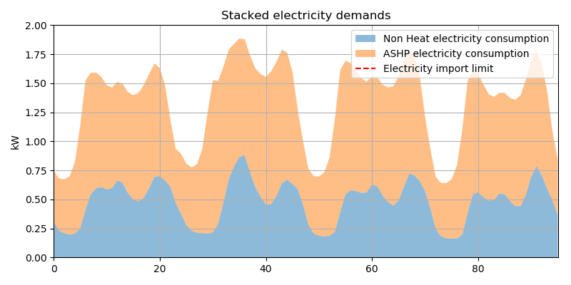

# Table of contents

- [Demand management of hybrid heating](#demand-management-of-hybrid-heating)
  - [Model](#model)
  - [Household assumption](#household-assumption)
  - [Techs](#techs)
  - [Weather data](#weather-data)
  - [Fuel cost](#fuel-cost)
  - [Carbon intensity](#carbon-intensity)
    - [Carbon intensity by fuel and geration techs:](#carbon-intensity-by-fuel-and-geration-techs)
    - [National grid average carbon intensity:](#national-grid-average-carbon-intensity)
    - [National grid Marginal carbon intensity:](#national-grid-marginal-carbon-intensity)
  - [Network](#network)
  - [Scenarios and results](#scenarios-and-results)
    - [Scenarios design](#scenarios-design)
    - [Cost per delivered heat](#cost-per-delivered-heat)
    - [Base case](#base-case)
    - [Network constraint](#network-constraint)
    - [ToU price](#tou-price)
    - [Average carbon intensity](#average-carbon-intensity)
    - [Marginal carbon intensity](#marginal-carbon-intensity)
    - [Covid-19 Case (on going)](#covid-19-case-on-going)

# Demand management of hybrid heating

This work present the demand management study of hybrid heating system at a single household under different cost-emission-network scenarios. A optimisation model is developed to minimise the total running cost to meet the end-use all heating demand in the single family house while subject to approximated network constraints. Cost signal considered both cost and also carbon emission of heating sources.

## Model

A (simple) LP optimisation model at this stage.

## Household assumption

Location: Edinburgh city

Type: a single family house

Study period: January of 2019 (To improve clarity, only results between '2019-01-08':'2019-01-11' is shown)

Annual Electricity Demand = 4200 kWh (peak at 0.8 kW)  
Annual heating Demand =  17000 kWh (peak at 5.5 kW)  
(source: Typical Domestic Consumption Values from ofgem)

The time series of simulated electricity (nonheating) and heating demand is shown in Figure.1.

## Techs
Hybrid heating equipment (air sourced heat pump (ASHP) and gas boiler) has been installed in the house. To focus on the impact of the exogenous factors, it is assumed that both heat pump and gas boiler is big enough to supply the house's peak heat demand on its own.

Size (input side): gas boiler = 7kWh; ASHP = 5kWh;  
Efficiency: gas boiler = 0.9; nominal COP of ASHP = 3.57

## Weather data
**Ambient temperature**:
heating demand is calibrated with the historical local temperature records. (see Figure.1 )

For advanced case, air sourced heat pump's actual COP could be also determined by outdoor ambient temperature.

## Fuel cost

**Retail price (fixed):**

Gas price = 0.035  # £/kwh

Electricity price = 0.135  # £/kwh

**ToU price (time varying):**

based on historical price of UK wholesale market (see Figure.1 )

## Carbon intensity
### Carbon intensity by fuel and geration techs:

| Fuel/techs| g/kWh|
|--------------------------|------|
| Gas current           | 185 |
| Gas future green      | 60  |
| Gas future supergreen | 40  |
| Coal power plant              | 937 |
| CCGT                  | 394 |
| OCGT                  | 651  |

### National grid average carbon intensity:

Historical data is used from national grid https://carbonintensity.org.uk/ (see Figure.1 )

### National grid Marginal carbon intensity:

A simple assumption is applied as:

When there is coal generation during the settlement period, the marginal carbon intensity is set as 937; when there is no coal but CCGT generation, the marginal carbon intensity is set as 394.

## Network:

1kW maximum import limit is applied when consider the constraints on the LV network.

Figure 1. Time series plot of input data

## Scenarios and results

### Scenarios design

The different combinations of following exogenous factors has been consider to build up scenarios.

Fuel price: flat/ToU

Emission: exclude/average/marginal

Network: exclude/include

###  Cost per delivered heat

While elelctriicty is expensive than gas per kW, the efficicty of ASPH is also higher. their comparison should be conduct using the cost per delivered heat.

**The cost per delivered heat** = cost of fuel per unit * (1 - loss during distribution) / efficiency of conversion technology

### Base case

| | |
|--------------------------|------|
|fuel price: |flat (Gas= 0.035 £/kwh; Electricity = 0.135 £/kwh)|
|emission: |excluded|
|network: |excluded|

This base scenario only consider current retail price without any price signal of emission or network.

The cost per delivered heat from Gas Boiler is 0.0389 £/kW  
The cost per delivered heat from ASPH is 0.0378 £/kW

********* Main results *********  
Total ASHP electricity consumption: 83.2 kWh  
Total ASHP heat output: 297.0 kWh  
Total Gas Boiler heat output: 0.0 kWh  
Total heat demand: 297.0 kWh  
Average ASHP Coefficient of Performance (COP): 3.57  

### Network constraint

| | |
|--------------------------|------|
|fuel price: |flat |
|emission: |excluded|
|network: |1kW|

The distribution network could face significant challenge due to the considerable increase of demand from heat pumps.

In this scenario, network constraint is considered as demand cap applied to the
individual house, and the optimisation model control the heating consistently with these constraints.

Given the peak non-heating demand which reflect the network before the deployment of ASHP is around 0.7kW, the electricity demand cap is set as 1kW and fixed for the whole period.

From the results shown below, it is clear during the period electricity demand cap is reached, the remaining heating demand is met by more expensive supply from gas boiler.

********* Main results *********  
Total ASHP electricity consumption: 44.8 kWh  
Total ASHP heat output: 160.1 kWh  
Total Gas Boiler heat output: 136.9 kWh  
Total heat demand: 297.0 kWh  

### ToU price

| | |
|--------------------------|------|
|fuel price: |varing price (indicative electricity price = 2 * spot price|
|emission: |excluded|
|network: |excluded|

The scenario considered what happens to demand patterns if electricity costs
reflected the time-varying cost in its production and distribution.

To approximate a ToU retail pricing scheme maybe available in the future, historical spot market price during the study period were subsequently scaled up (doubel here) to match the range of current retail price, as the hybrid heating system is
controlling based on the relative gas:electricity price.

********* Main results *********

Total ASHP electricity consumption: 64.3 kWh  
Total ASHP heat output: 229.5 kWh  
Total Gas Boiler heat output: 67.5 kWh

### Average carbon intensity

| | |
|--------------------------|------|
|fuel price: |using indicative price to reflect the carbon emissions of resource fuel: electricity --> hourly UK grid Avaragecarbon intensity £;  gas --> 185 £ |
|emission: |considered, see above|
|network: |excluded|

This scenario considered what happens to demand patterns if electricity costs
reflected time-varying carbon emission of electricity imported from the grid. Without carbon pricing, the electricity cost is directly replaced by the numerical value of Average carbon intensity. The results are shown below.

********* Main results *********

Total ASHP electricity consumption: 83.2 kWh  
Total ASHP heat output: 297.0 kWh   
Total Gas Boiler heat output: 0.0 kWh  
Total heat demand: 297.0 kWh

The indicative cost per delivered heat from Gas Boiler is considerable higher than ASHP throughout this period, therefore heating demand is fully provide by ASHP.

### Marginal carbon intensity

| | |
|--------------------------|------|
|Fuel price: |using indicative price to reflect the carbon emissions of resource fuel: electricity --> hourly UK grid Marginal carbon intensity £;  gas --> 185 £ |
|emission: |considered, see above|
|network: |excluded|

This scenario considered using 'marginal' carbon intensity as price signals. Different from average carbon intensity, marginal carbon intensity normally has higher value and provide more strong incentive of switch to alternative heating sources when heavy emission power plant (such  as coal) is used during the settlement period.

The half-hourly marginal carbon intensity value is approximated by:

From National grid historical settlement data, identifying times when coal generation exceeded 9,000MW, and allocating the carbon intensity of coal-generated electricity at these times (937 gCO2/kWh). At other times the electricity was allocated the carbon intensity of the next-worst generator (combined cycle gas turbines or CCGTs, assumed to be gCO2/kWh)

********* Main results *********

Total ASHP electricity consumption: 8.0 kWh  
Total ASHP heat output: 28.4 kWh  
Total Gas Boiler heat output: 268.6 kWh  
Total heat demand: 297.0 kWh  

### Covid-19 Case (on going)

Given that UK national grid has been operated without coal for over a month during this pandamic (such scenario is highly likely in the future), it is interesting to see how the hybrid heating system may operate response to such consistently low carbon scenario.
